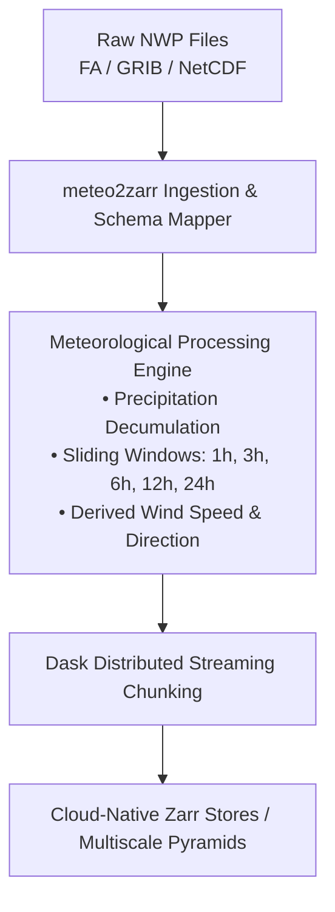

<div align="center">

# 🌦️ meteo2zarr

**High-Performance NWP to Cloud-Native Zarr Converter for Meteorological & Climate Data**

[](https://www.python.org/)
[](https://opensource.org/licenses/Apache-2.0)
[](https://github.com/astral-sh/ruff)
[]()

*Convert Numerical Weather Prediction outputs (AROME, ALADIN, ARPEGE, ECMWF IFS, GFS in FA, GRIB, NetCDF) into cloud-optimized, sharded, multi-dimensional Zarr stores with sliding meteorological accumulations and distributed streaming writes.*

---

</div>

## 🌟 Key Highlights

- **🚀 Distributed & Lazy Streaming**: Powered by **Dask** and **ProcessPoolExecutor** for parallel ingestion and chunked writing without out-of-memory errors.
- **🌧️ Meteorological Accumulation Engine**: Automatic decumulation of raw model precipitation and sliding window calculations ($1\text{h}$, $3\text{h}$, $6\text{h}$, $12\text{h}$, $24\text{h}$).
- **📐 Derived Diagnostics**: Instant computation of vector magnitude (wind speed), direction, and unit conversions (Kelvin to Celsius, Pa to hPa).
- **☁️ Cloud & Web Visualization Optimized**: Calibrated chunking hierarchy designed for **TiTiler-Xarray**, **MapLibre**, and **ndpyramid**.
- **💻 Dual Execution Profile**: Runs smoothly on local developer laptops as well as HPC clusters (Slurm).

---

## 📦 Installation

```bash
# Standard installation
pip install meteo2zarr

# With GRIB support (eccodes / cfgrib)
pip install meteo2zarr[grib]

# With FA support (epygram)
pip install meteo2zarr[fa]

# Complete installation (all formats + pyramids)
pip install meteo2zarr[all]
```

---

## ⚡ Quickstart

### 1. Command Line Interface (CLI)

```bash
# Convert a local model run
meteo2zarr convert \
    --model arome \
    --run 2026030100 \
    --input /path/to/raw/files \
    --output ./zarr_output \
    --dask-workers 4 \
    --chunk-time 6
```

### 2. Python API

```python
from datetime import datetime
from meteo2zarr import NWPConverter

# Initialize converter
converter = NWPConverter(
    output_dir="./zarr_output",
    dask_workers=4,
    chunk_time=6,
)

# Run conversion
success = converter.convert(
    input_dir="/path/to/raw/files",
    model="arome",
    run_date=datetime(2026, 3, 1, 0, 0),
    dt_hours=1.0,
)
```

---

## 🛠️ Architecture



---

## 🧪 Testing

```bash
pytest tests/
```

---

## 📄 License

Distributed under the **Apache 2.0** License. See `LICENSE` for more information.
