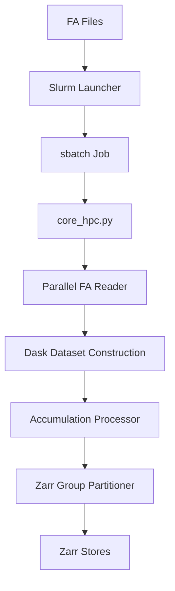

# NWP to Zarr Converter

Welcome to the documentation for the **NWP to Zarr Converter**. This tool is designed for high-performance conversion of Numerical Weather Prediction (NWP) data (primarily **AROME** and **ALADIN** in FA format) into cloud-optimized **Zarr** stores.

## Key Features

- **🚀 High Performance**: Parallelized reading of FA files via `ProcessPoolExecutor` and streaming writing via `Dask`.
- **☁️ Cloud Optimized**: Generates Zarr stores with optimized chunking for visualization (TiTiler, MapLibre).
- **🛠️ Slurm Integration**: includes a robust Slurm launcher for job submission, job arrays, and automated cron tasks.
- **🔄 Sliding Accumulations**: Automatically handles precipitation decumulation and sliding window calculations.
- **📁 Structured Groups**: Organized output by level types (surface, isobaric, height, etc.) and accumulation durations (3h, 6h, 12h, 24h).
- **📊 Dask Dashboard**: Real-time monitoring of conversion progress and resource usage.

## Architecture Overview

## Getting Started

1.  **Installation**: Set up the virtual environment and dependencies in [Installation Guide](guide/installation.md).
2.  **Configuration**: Define your variable mappings and groups in [Configuration](guide/configuration.md).
3.  **Usage**: Run your first conversion job with [Usage Examples](guide/usage.md).
