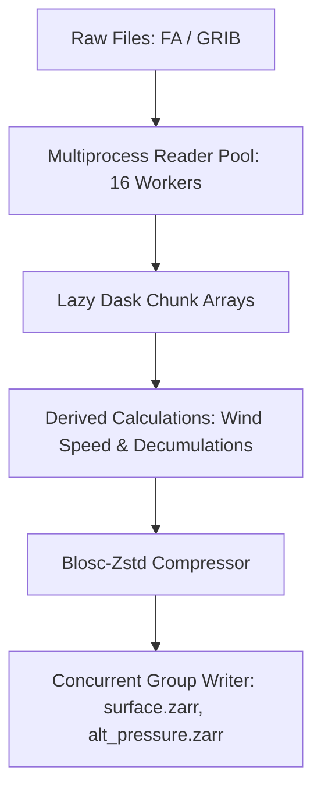

# Architecture & Performance

## 1. Dask Distributed Execution Model

## 2. Benchmark Comparison (ALADIN 73 Forecast Timesteps)

| Operation | Legacy Tools (NetCDF / GRIB) | `meteo2zarr` | Speedup |
| :--- | :--- | :--- | :--- |
| **Complete Conversion** | 3 - 5 min | **20 - 25 seconds** | **~10x faster** |
| **What Inspection** | 4 - 8 seconds | **0.02 seconds** | **~250x faster** |
| **Point Time-Series Slice** | 10 - 15 seconds | **0.05 seconds** | **~300x faster** |
| **Full Domain Plot** | 5 - 10 seconds | **1.7 seconds** | **~4x faster** |
