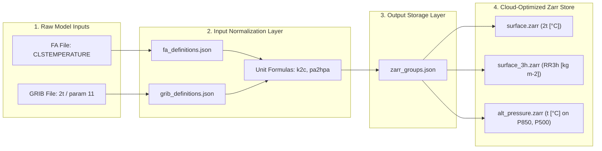

# Declarative Configuration System: Multi-Model Unification

## 🎯 The Core Philosophy

In operational meteorology and modern **Full-Stack Web GIS applications** (MapLibre GL, Leaflet, OpenLayers, Titiler), frontend and downstream analytics require **strictly homogeneous data contracts**:
- Identical canonical variable names (**`shortname`**).
- Identical physical units and unified standard coordinates.
- Predictable multi-dimensional array shapes.

However, raw meteorological models output heterogeneous keys and formats:
- **AROME / ALADIN (FA format)**: uses internal Arpege/Accord keys like `CLSTEMPERATURE`, `SURFACCPLUIE`, `SURFPREC.EAU.CON`.
- **GRIB1 / GRIB2 format**: uses WMO numerical codes, edition-dependent keys, or shortnames like `2t`, `tp`, `10u`.

**`meteo2zarr` solves this problem at the root through a declarative, 100% data-driven JSON architecture.**  
You can map new parameters, apply mathematical formulas, create sliding window accumulations, and define custom storage partitions **without writing a single line of Python code**.

---

## 🏛️ Architecture: Input Mapping vs Storage Hierarchy



| Configuration File | Scope & Role | What it controls |
| :--- | :--- | :--- |
| **`fa_definitions.json`** | **FA/LFA Decoding & Normalization** | Recognizes vertical prefixes (`CLS`, `P`, `H`, `V`), ignores unwanted fields (`skip_fields`), maps raw FA fieldnames to canonical `shortname`, assigns physical units and formulas (`k2c`, `pa2hpa`, `div98`). |
| **`grib_definitions.json`** | **GRIB1/GRIB2 Decoding & Normalization** | Maps GRIB shortnames, `grib1_param` IDs, and `grib2_key` tuples to the exact same canonical `shortname`, units, and formulas as `fa_definitions.json`. |
| **`zarr_groups.json`** | **Zarr Store Partitioning & Chunking** | Dispatches normalized variables into independent Zarr sub-groups (`surface`, `surface_3h`, `alt_pressure`, `alt_pv`) using level matching and parameter filtering. |

---

## 🔬 Anatomy of a Parameter: Step-by-Step Breakdown

Let us trace **2-meter Temperature** through the entire pipeline:

### 1. In `fa_definitions.json` (FA Model Source)
```json
{
  "levels": {
    "CLS": {
      "type": "surface",
      "unit": "2m",
      "description": "Constant Level Surface (2m diagnostics)"
    }
  },
  "fields": {
    "CLSTEMPERATURE": {
      "shortname": "2t",
      "unit": "Celsius",
      "formula": "k2c",
      "desc": "2m Temperature"
    }
  }
}
```

### 2. In `grib_definitions.json` (GRIB Model Source)
```json
{
  "fields": {
    "2t": {
      "shortname": "2t",
      "unit": "Celsius",
      "formula": "k2c",
      "desc": "2m Temperature",
      "grib1_param": "11",
      "grib2_key": "0.0.0"
    }
  }
}
```

### 3. In `zarr_groups.json` (Output Destination Group)
```json
{
  "groups": {
    "surface": {
      "description": "Paramètres de surface (Niveau 0, 2m, 10m)",
      "match": {
        "level_types": ["surface", "height"],
        "exclude": ["RR3h", "RR6h", "RR12h", "RR24h"]
      }
    }
  }
}
```

### 🎯 Result in the Final Zarr Store:
Regardless of whether the input was an FA file or a GRIB file:
- **Group**: `surface`
- **Array Name**: `2t`
- **Attributes**: `{"long_name": "2m Temperature", "units": "Celsius", "level_type": "surface", "level": 2.0}`
- **Values**: Automatically transformed from Kelvin to Celsius via the exact formula $T_{°C} = T_K - 273.15$.

---

## ⏱️ Sliding Window Accumulations: How Precipitation Decumulations Work

In NWP models, rainfall is accumulated since the start of the model run:
$$\text{Total Rain}(T) = \int_0^T P(t) \, dt$$

Meteorologists and hydrological forecasting applications need sliding window decumulations (e.g., rain in the last 3 hours: $RR_{3h}(T) = \text{Acc}(T) - \text{Acc}(T-3h)$).

### Configuration in `fa_definitions.json` & `grib_definitions.json`:
```json
{
  "accumulations": {
    "SURFACCPLUIE": ["3h", "6h", "12h", "24h"],
    "twatp_con": ["3h", "6h", "12h", "24h"],
    "twatp_gec": ["3h", "6h", "12h", "24h"],
    "tp": ["3h", "6h", "12h", "24h"]
  }
}
```

### Dynamic Dispatch in `zarr_groups.json`:
```json
{
  "groups": {
    "surface_3h": {
      "description": "Cumuls 3h (Précipitations)",
      "match": {
        "parameters": ["RR3h", "tp_3h", "twatp_con_3h", "twatp_gec_3h"]
      }
    },
    "surface_6h": {
      "description": "Cumuls 6h (Précipitations)",
      "match": {
        "parameters": ["RR6h", "tp_6h", "twatp_con_6h", "twatp_gec_6h"]
      }
    }
  }
}
```
The accumulation engine (`processing/accumulations.py`) performs high-speed vectorized lazy shifting on Dask chunks, guaranteeing exact zero-difference mathematical precision.

---

## ⚙️ Unit Formulas and Mathematical Transforms Engine

### Where are the formulas located?
Formulas are implemented in the high-performance module:  
👉 **`src/meteo2zarr/processing/derived.py`** (`apply_unit_formula()`).

### Built-in Formulas Reference:

| Formula Key | Mathematical Operation | Typical Meteorological Usage |
| :--- | :--- | :--- |
| `"k2c"` | $X - 273.15$ | Absolute temperature (Kelvin) to Celsius (°C) |
| `"pa2hpa"` | $X / 100.0$ | Surface pressure (Pascals) to Hectopascals (hPa) |
| `"div98"` | $X / 9.80665$ | Geopotential ($m^2 s^{-2}$) to Geopotential Height ($gpm$) |
| `"percent"` | $X \times 100.0$ | Relative humidity / Cloud cover fraction $[0, 1] \rightarrow [0, 100\%]$ |
| `"none"` / `"None"` | $X$ (Identity) | Unmodified physical values (Wind $u, v$, $W m^{-2}$, etc.) |

---

## 🛠️ Complete Guide: Adding a New Parameter, Group, or Formula

### Scenario: Adding Surface Solar Radiation (`ssrd`) and a New Custom Formula

#### Step 1: (If needed) Register a new mathematical formula in `processing/derived.py`
```python
# In src/meteo2zarr/processing/derived.py:
elif f == "joule2kwh": # Convert Joules to Kilowatt-hours
    res = da / 3.6e6
    res.attrs["unit"] = "kWh m-2"
    return res
```

#### Step 2: Declare the parameter in `fa_definitions.json` and/or `grib_definitions.json`
```json
"SURFRAYT.SOLA.DE": {
  "shortname": "ssrd",
  "unit": "kWh m-2",
  "formula": "joule2kwh",
  "desc": "Surface Solar Radiation Downwards"
}
```

#### Step 3: Add Decumulation Intervals (Optional)
```json
"accumulations": {
  "ssrd": ["3h", "6h", "24h"]
}
```

#### Step 4: Route the new field into a Zarr group in `zarr_groups.json`
To place it in the `surface` group:
```json
"surface": {
  "description": "Paramètres de surface",
  "match": {
    "level_types": ["surface", "height"]
  }
}
```
*Because its level type is `"surface"`, `meteo2zarr` automatically bundles it into `surface.zarr`!*

---

## 🚀 Running Conversion with Custom Configuration

You do not need to alter the packaged source files. You can provide an external configuration directory via the CLI `--config` option:

```bash
# Ingest with customized JSON definitions
meteo2zarr convert \
  --model aladin \
  --run 2026081900 \
  --input /data/aladin/run_00 \
  --output /data/zarr_stores \
  --config /home/chikhi/my_custom_configs/
```
