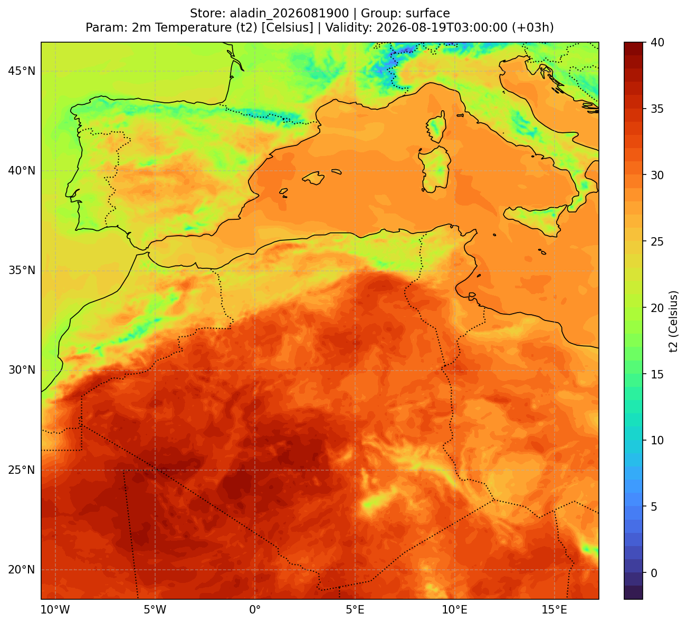
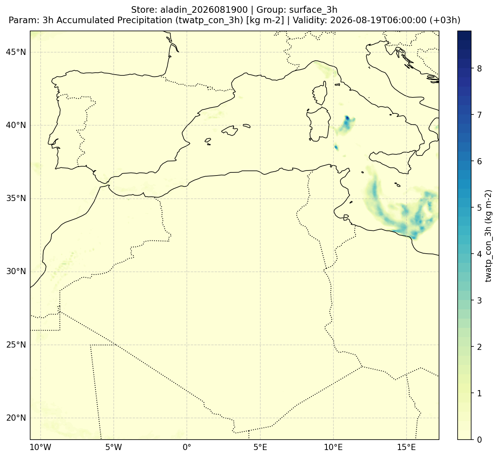
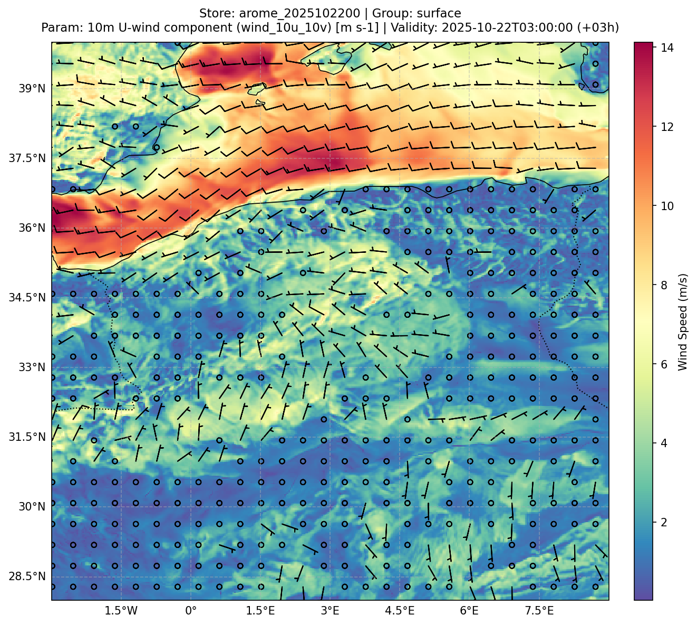
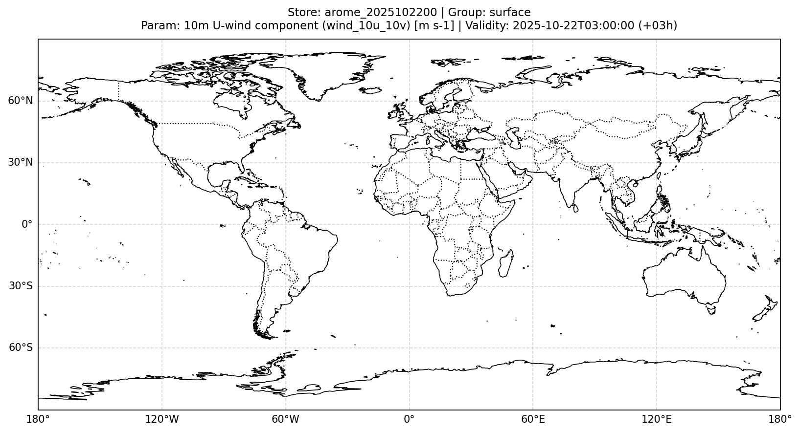

# Cartographic Plotting

`meteo2zarr` includes a high-performance cartographic rendering engine built on top of Matplotlib and Cartopy, optimized to render maps in less than 2 seconds using pre-cached local NaturalEarth geometries.

---

## 1. Gallery of Generated Products

Here are sample figures generated directly from real AROME and ALADIN model outputs converted with `meteo2zarr`:

### Temperature Field with Shaded Contours
```python
store.plot('t2', timestep=3, plot_method='contourf', colormap='turbo', savefig=True)
```


---

### Decumulated 3h Precipitation
```python
store.plot('twatp_con_3h', timestep=3, group='surface_3h', plot_method='contourf', colormap='YlGnBu', savefig=True)
```


---

### Wind Vectors (Meteorological Barbs)
```python
store.plot(wu='10u', wv='10v', timestep=3, vector_plot_method='barbs', vectors_subsampling=15, savefig=True)
```


---

### Streamlines over Temperature
```python
store.plot(field='2t', wu='10u', wv='10v', timestep=3, vector_plot_method='streamplot', plot_method='pcolormesh', savefig=True)
```


---

## 2. Automatic Title and Filename Conventions

When saving with `-O` or `savefig=True`, filenames and titles follow clean, structured conventions:

- **Filename format**: `<store>_<subgroup>_<param>_<date>_<timestep>.png`  
  *Example*: `aladin_2026081900_surface_2t_2026081903_t03.png`
- **Title format (2-line layout)**:  
  ```text
  Store: <store> | Group: <group>
  Param: <param_description> [<unit>] | Validity: <datetime> (+<step>h)
  ```

---

## 3. CLI Commands Reference

```bash
# Plot with automatic naming and 2-line header
meteo2zarr plot output_zarr/aladin_2026081900 -f 2t --timestep 3 -O

# Shaded contour plot (contourf) with custom colormap
meteo2zarr plot output_zarr/aladin_2026081900 -f 2t --pm contourf -c turbo -O

# Centering colormap on 0 (ideal for anomalies or Celsius temperature around 0°C)
meteo2zarr plot output_zarr/aladin_2026081900 -f 2t -t -O

# Clamped range min/max
meteo2zarr plot output_zarr/aladin_2026081900 -f 2t -m "0,45" -O

# Wind barbs
meteo2zarr plot output_zarr/aladin_2026081900 --wU 10u --wV 10v --vpm barbs -s 15 -O

# Geographic zoom
meteo2zarr plot output_zarr/aladin_2026081900 -f 2t --zoom "lonmin=-2, lonmax=12, latmin=30, latmax=40" -O
```
