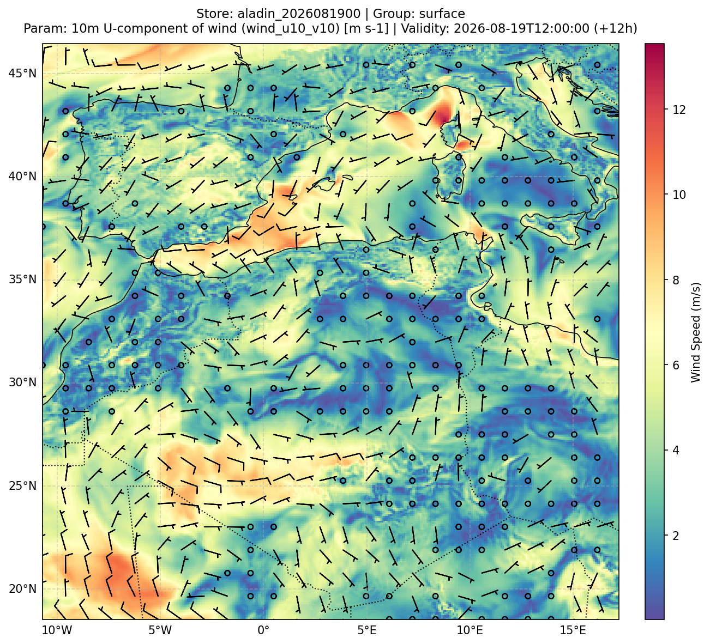
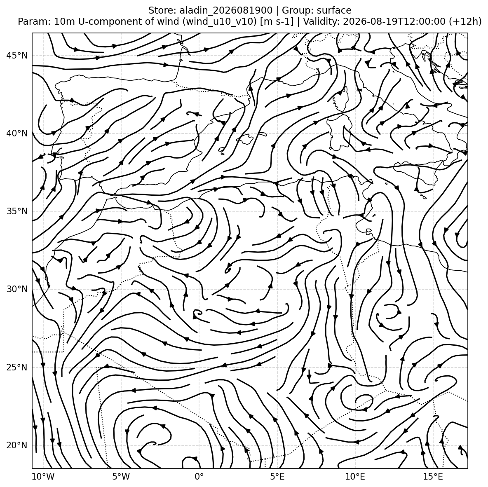
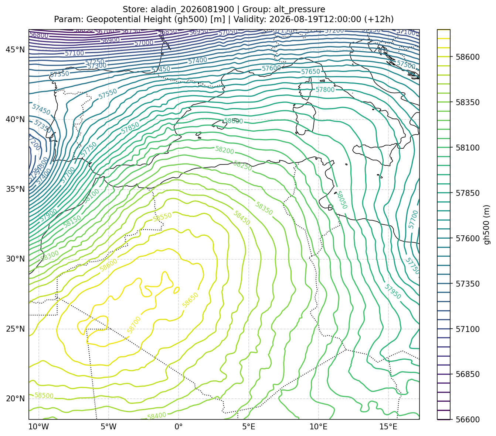

# Cartographic Plotting

`meteo2zarr` includes a high-performance cartographic rendering engine built on top of Matplotlib and Cartopy, optimized to render publication-ready maps in less than 2 seconds using pre-cached local NaturalEarth geometries and automatic domain bounding.

---

## 1. Gallery of Generated Products (ALADIN Operational Domain)

The following figures illustrate the diverse plotting capabilities of `meteo2zarr` generated directly from the complete operational ALADIN dataset:

### 10m Wind Vectors (Meteorological Barbs & Color-coded Speed)
```python
store.plot(wu='u10', wv='v10', timestep=12, group='surface', vector_plot_method='barbs', vectors_subsampling=14, savefig=True)
```


---

### Streamlines over 2m Temperature Background
```python
store.plot(field='t2', wu='u10', wv='v10', timestep=12, group='surface', vector_plot_method='streamplot', plot_method='pcolormesh', colormap='Spectral_r', savefig=True)
```


---

### 500 hPa Geopotential Height (Isoline Contours)
```python
store.plot(field='gh500', timestep=12, group='alt_pressure', plot_method='contour', colormap='viridis', savefig=True)
```


---

### 2m Temperature Field (Shaded Contours + Turbo Colormap)
```python
store.plot(field='t2', timestep=12, plot_method='contourf', colormap='turbo', savefig=True)
```


---

### Decumulated 3-Hour Convective Precipitation
```python
store.plot(field='twatp_con_3h', timestep=12, group='surface_3h', plot_method='contourf', colormap='YlGnBu', savefig=True)
```


---

## 2. Automatic Title and Filename Conventions

When saving with `-O` or `savefig=True`, filenames and titles follow clean, structured conventions:

- Filename format: `<store>_<subgroup>_<param>_<date>_<timestep>.png`  
  *Example*: `aladin_2026081900_surface_t2_2026081912_t12.png`
- Title format (2-line layout):
  ```text
  Store: <store> | Group: <group>
  Param: <param_description> [<unit>] | Validity: <datetime> (+<step>h)
  ```

---

## 3. CLI Commands Reference

```bash
# Plot 10m wind barbs with background speed
meteo2zarr plot output_zarr/aladin_2026081900 --wU u10 --wV v10 --vpm barbs -s 14 -O

# Streamlines over 2m temperature
meteo2zarr plot output_zarr/aladin_2026081900 -f t2 --wU u10 --wV v10 --vpm streamplot -c Spectral_r -O

# 500 hPa Geopotential Height isolines
meteo2zarr plot output_zarr/aladin_2026081900 -f gh500 -g alt_pressure --pm contour -c viridis -O

# Shaded contour plot (contourf) with custom colormap
meteo2zarr plot output_zarr/aladin_2026081900 -f t2 --pm contourf -c turbo -O

# Centering colormap on 0 (ideal for anomalies or Celsius temperature around 0°C)
meteo2zarr plot output_zarr/aladin_2026081900 -f t2 -t -O

# Geographic zoom onto custom bounding box
meteo2zarr plot output_zarr/aladin_2026081900 -f t2 --zoom "lonmin=-2, lonmax=12, latmin=30, latmax=40" -O
```
