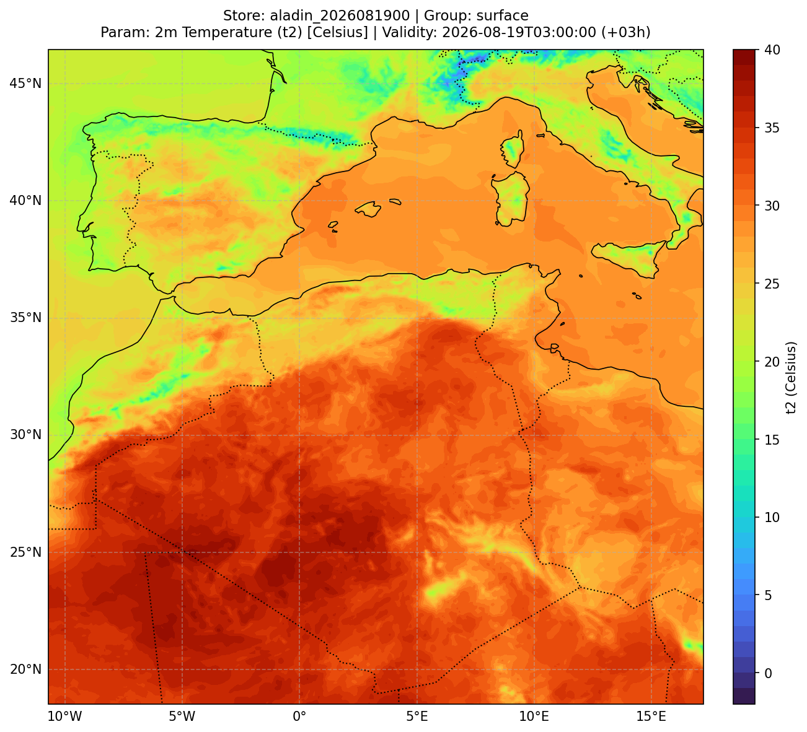
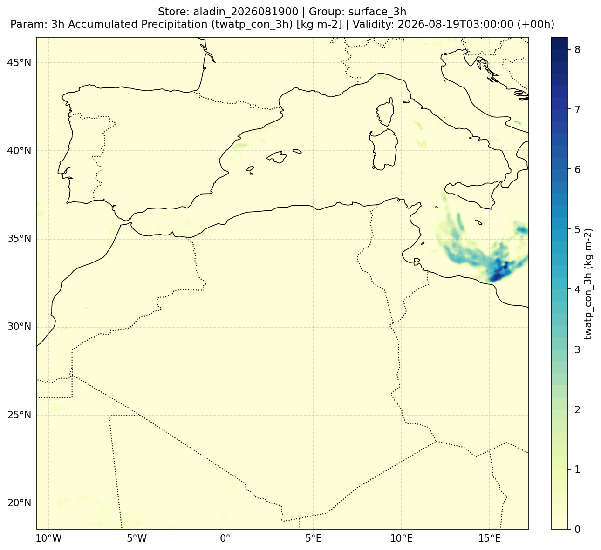
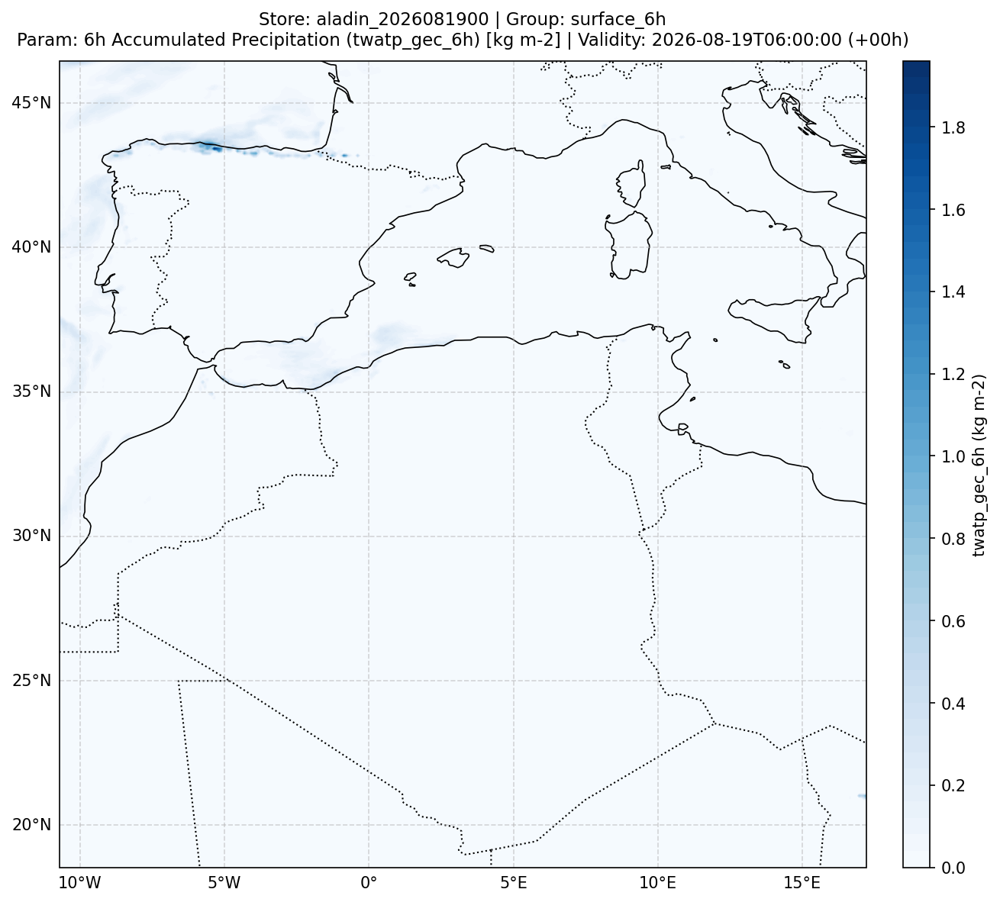
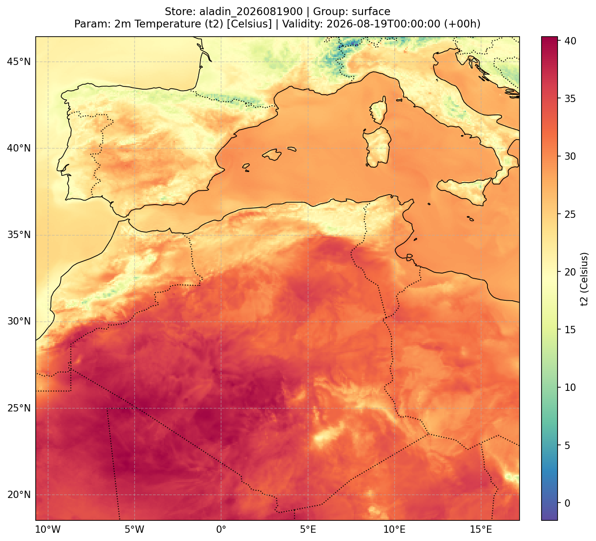

# Cartographic Plotting

`meteo2zarr` includes a high-performance cartographic rendering engine built on top of Matplotlib and Cartopy, optimized to render publication-ready maps in less than 2 seconds using pre-cached local NaturalEarth geometries and automatic domain bounding.

---

## 1. Gallery of Generated Products (ALADIN Full Domain)

Here are sample figures generated directly from real ALADIN operational model outputs converted with `meteo2zarr`:

### 2m Temperature Field (Shaded Contours + Turbo Colormap)
```python
store.plot('t2', timestep=3, plot_method='contourf', colormap='turbo', savefig=True)
```


---

### Decumulated 3-Hour Convective Precipitation
```python
store.plot('twatp_con_3h', timestep=0, group='surface_3h', plot_method='contourf', colormap='YlGnBu', savefig=True)
```


---

### Decumulated 6-Hour Large-Scale Precipitation
```python
store.plot('twatp_gec_6h', timestep=0, group='surface_6h', plot_method='contourf', colormap='Blues', savefig=True)
```


---

### 2m Temperature Field (Fast Pcolormesh + Spectral_r)
```python
store.plot('t2', timestep=0, plot_method='pcolormesh', colormap='Spectral_r', savefig=True)
```


---

## 2. Automatic Title and Filename Conventions

When saving with `-O` or `savefig=True`, filenames and titles follow clean, structured conventions:

- Filename format: `<store>_<subgroup>_<param>_<date>_<timestep>.png`  
  *Example*: `aladin_2026081900_surface_t2_2026081903_t03.png`
- Title format (2-line layout):
  ```text
  Store: <store> | Group: <group>
  Param: <param_description> [<unit>] | Validity: <datetime> (+<step>h)
  ```

---

## 3. CLI Commands Reference

```bash
# Plot with automatic naming and 2-line header
meteo2zarr plot output_zarr/aladin_2026081900 -f t2 --timestep 3 -O

# Shaded contour plot (contourf) with custom colormap
meteo2zarr plot output_zarr/aladin_2026081900 -f t2 --pm contourf -c turbo -O

# Centering colormap on 0 (ideal for anomalies or Celsius temperature around 0°C)
meteo2zarr plot output_zarr/aladin_2026081900 -f t2 -t -O

# Clamped range min/max
meteo2zarr plot output_zarr/aladin_2026081900 -f t2 -m "0,45" -O

# Geographic zoom onto custom bounding box
meteo2zarr plot output_zarr/aladin_2026081900 -f t2 --zoom "lonmin=-2, lonmax=12, latmin=30, latmax=40" -O
```
